# 面试SQL题汇总

语兴链接：[https://oxtwry26ao.feishu.cn/mindnotes/bmncnCxiGnEedT4I8hTHMAwGXtg#mindmap](https://oxtwry26ao.feishu.cn/mindnotes/bmncnCxiGnEedT4I8hTHMAwGXtg#mindmap)

## 连续登入

### 查询连续登陆3天以上的用户(字节面试题)

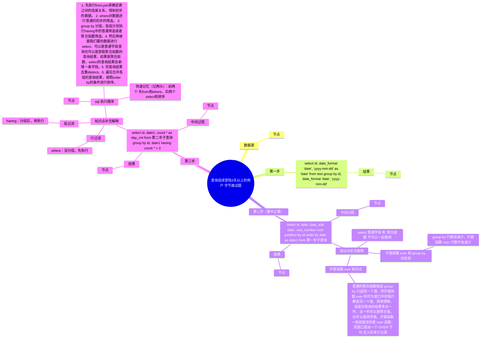
```mermaid
mindmap
  root((查询连续登陆3天以上的用户 字节面试题))
    数据源
      节点
    第一步
      select id, date_format 'date', 'yyyy-mm-dd' as 'date' from test group by id, date_format 'date', 'yyyy-mm-dd'
        结果
          节点
    第二步（重中之重）
      select id, date, date_add date, -row_number over partition by id order by date as date1 from 第一步子查询
        中间过程
          节点
        结果
          节点
        知识点补充解释
          开窗函数 over 和 group by 的区别
            group by 行数会减少，开窗函数 over 行数不会减少
          开窗函数 over 知识点
            普通的聚合函数每组 group by 只返回一个值，而开窗函数 over 则可为窗口中的每行都返回一个值，简单理解，就是对查询的结果多出一列，这一列可以是聚合值，也可以是排序值。开窗函数一般就是说的是 over 函数，其窗口是由一个 OVER 子句 定义的多行记录
          select 普通字段 和 聚合函数 不可以一起使用
    第三步
      select id, date1, count * as day_cnt from 第二步子查询 group by id, date1 having count * > 3
        中间过程
          节点
        结果
          节点
        知识点补充解释
          行过滤
            where：没分组，先执行
          组过滤
            having：分组后，再执行
          sql 执行顺序
            节点
            1. 先执行from,join来确定表之间的连接关系，得到初步的数据。 2. where对数据进行普通的初步的筛选。 3. group by 分组，各组分别执行having中的普通筛选或者聚合函数筛选。4. 然后再根据我们要的数据进行select，可以是普通字段查询也可以是获取聚合函数的查询结果，如果是聚合函数，select的查询结果会新增一条字段。5. 将查询结果去重distinct。6. 最后合并各组的查询结果，按照order by的条件进行排序。
            快速记忆（记两头）：前两个 先from和where，后两个 select和排序
```

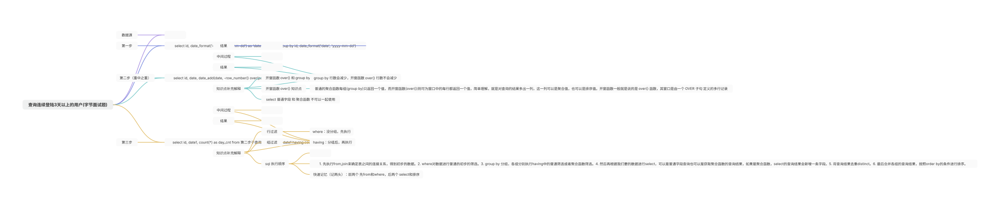

  

### 每个用户查询连续登入最大天数(字节面试题)

  

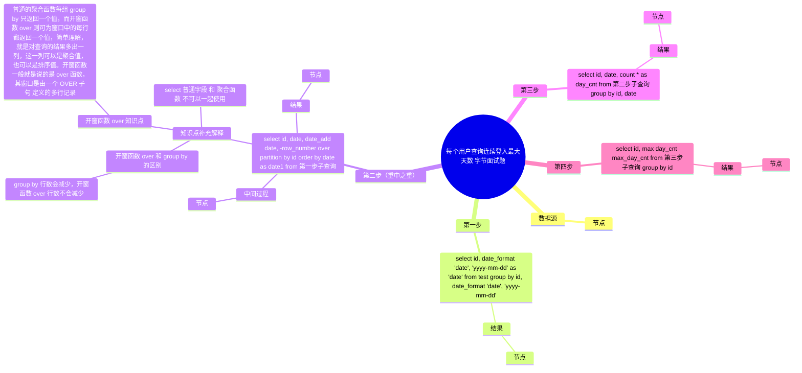
```mermaid
mindmap
  root((每个用户查询连续登入最大天数 字节面试题))
    数据源
      节点
    第一步
      select id, date_format 'date', 'yyyy-mm-dd' as 'date' from test group by id, date_format 'date', 'yyyy-mm-dd'
        结果
          节点
    第二步（重中之重）
      select id, date, date_add date, -row_number over partition by id order by date as date1 from 第一步子查询
        中间过程
          节点
        结果
          节点
        知识点补充解释
          开窗函数 over 和 group by 的区别
            group by 行数会减少，开窗函数 over 行数不会减少
          开窗函数 over 知识点
            普通的聚合函数每组 group by 只返回一个值，而开窗函数 over 则可为窗口中的每行都返回一个值，简单理解，就是对查询的结果多出一列，这一列可以是聚合值，也可以是排序值。开窗函数一般就是说的是 over 函数，其窗口是由一个 OVER 子句 定义的多行记录
          select 普通字段 和 聚合函数 不可以一起使用
    第三步
      select id, date, count * as day_cnt from 第二步子查询 group by id, date
        结果
          节点
    第四步
      select id, max day_cnt max_day_cnt from 第三步子查询 group by id
        结果
          节点
```

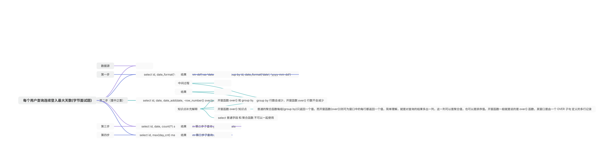

  

  

### **每个用户**间断一天也算作连续，**连续登录最大天数**

  

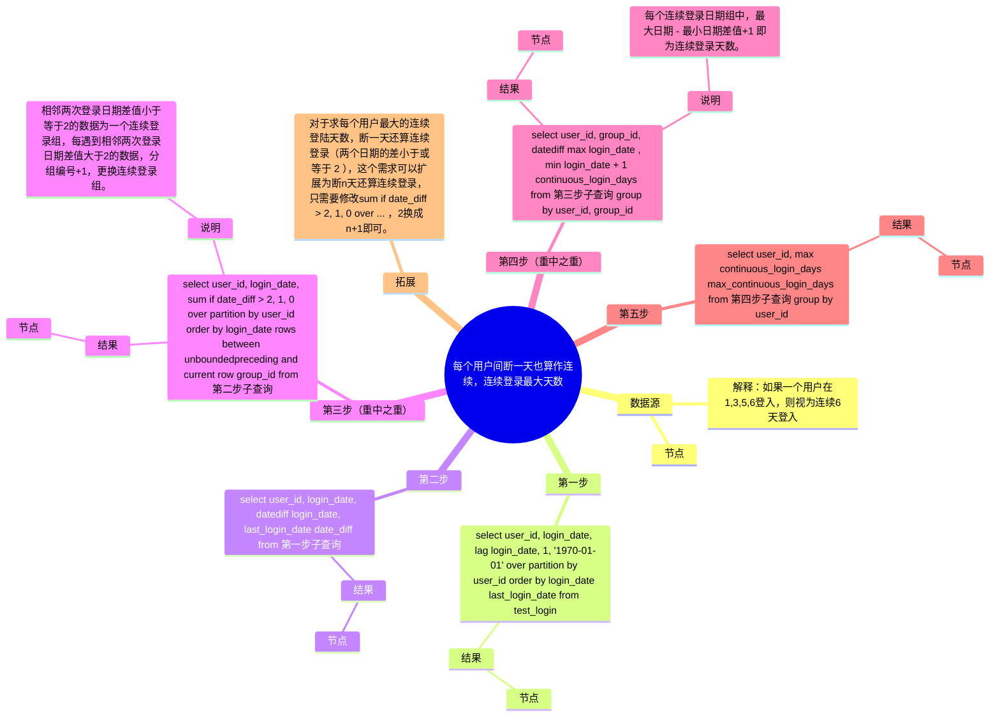
```mermaid
mindmap
  root((每个用户间断一天也算作连续，连续登录最大天数))
    数据源
      节点
      解释：如果一个用户在1,3,5,6登入，则视为连续6天登入
    第一步
      select user_id, login_date, lag login_date, 1, '1970-01-01' over partition by user_id order by login_date last_login_date from test_login
        结果
          节点
    第二步
      select user_id, login_date, datediff login_date, last_login_date date_diff from 第一步子查询
        结果
          节点
    第三步（重中之重）
      select user_id, login_date, sum if date_diff > 2, 1, 0 over partition by user_id order by login_date rows between unboundedpreceding and current row group_id from 第二步子查询
        结果
          节点
        说明
          相邻两次登录日期差值小于等于2的数据为一个连续登录组，每遇到相邻两次登录日期差值大于2的数据，分组编号+1，更换连续登录组。
    第四步（重中之重）
      select user_id, group_id, datediff max login_date , min login_date + 1 continuous_login_days from 第三步子查询 group by user_id, group_id
        结果
          节点
        说明
          每个连续登录日期组中，最大日期 - 最小日期差值+1 即为连续登录天数。
    第五步
      select user_id, max continuous_login_days max_continuous_login_days from 第四步子查询 group by user_id
        结果
          节点
    拓展
      对于求每个用户最大的连续登陆天数，断一天还算连续登录（两个日期的差小于或等于 2 ），这个需求可以扩展为断n天还算连续登录，只需要修改sum if date_diff > 2, 1, 0 over ... ，2换成n+1即可。
```

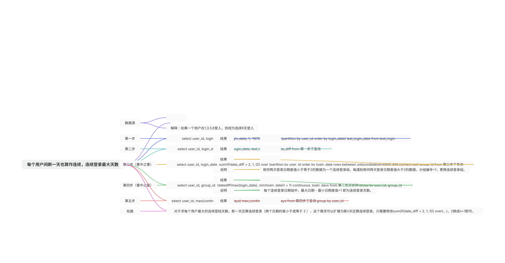

  

  

  

## 波峰波谷

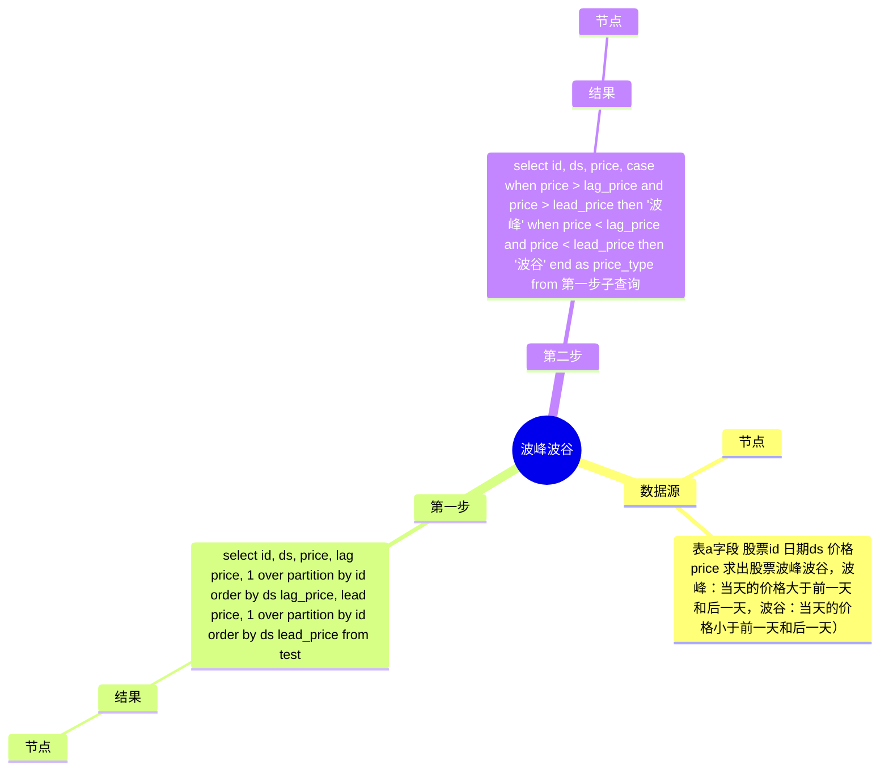
```mermaid
mindmap
  root((波峰波谷))
    数据源
      节点
      表a字段 股票id 日期ds 价格price 求出股票波峰波谷，波峰：当天的价格大于前一天和后一天，波谷：当天的价格小于前一天和后一天）
    第一步
      select id, ds, price, lag price, 1 over partition by id order by ds lag_price, lead price, 1 over partition by id order by ds lead_price from test
        结果
          节点
    第二步
      select id, ds, price, case when price > lag_price and price > lead_price then '波峰' when price < lag_price and price < lead_price then '波谷' end as price_type from 第一步子查询
        结果
          节点
```

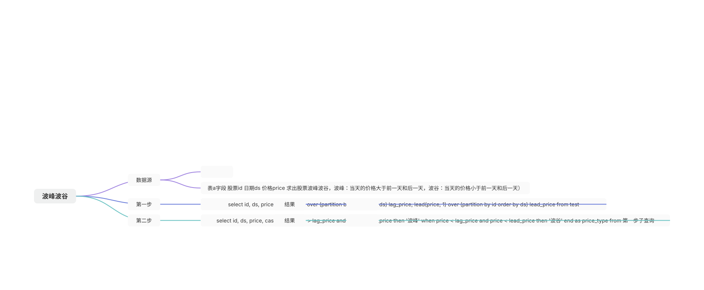

  

## 将a表转换为b表（lead/lag/last\_value/first\_value使用）

  

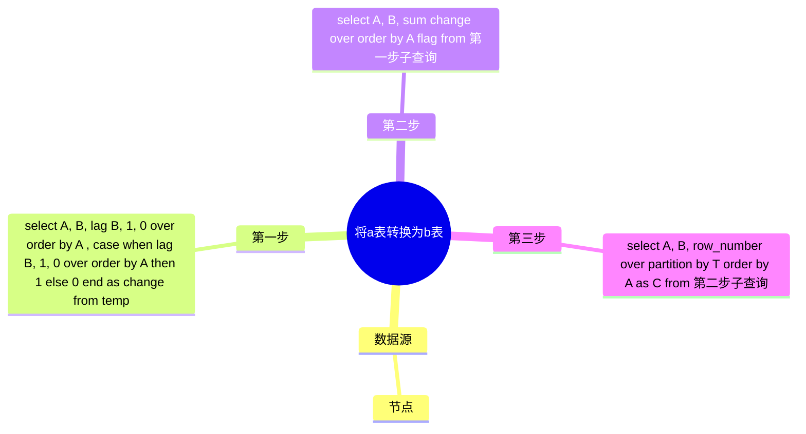
```mermaid
mindmap
  root((将a表转换为b表))
    数据源
      节点
    第一步
      select A, B, lag B, 1, 0 over order by A , case when lag B, 1, 0 over order by A then 1 else 0 end as change from temp
    第二步
      select A, B, sum change over order by A flag from 第一步子查询
    第三步
      select A, B, row_number over partition by T order by A as C from 第二步子查询
```

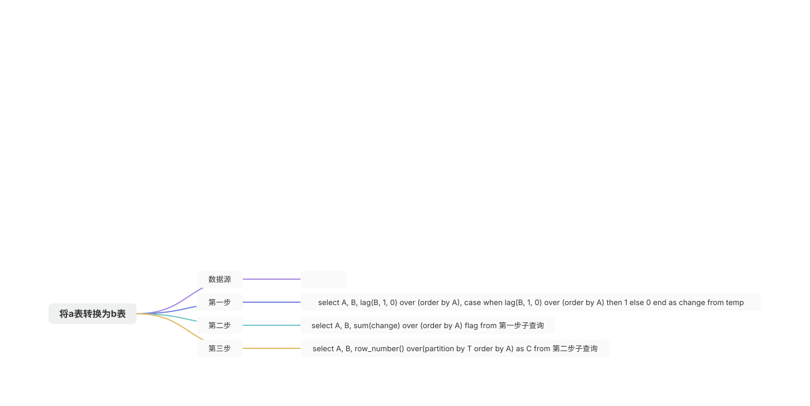

  

  

## 三种排序(排序开窗),第几名/前几名/topN/top1

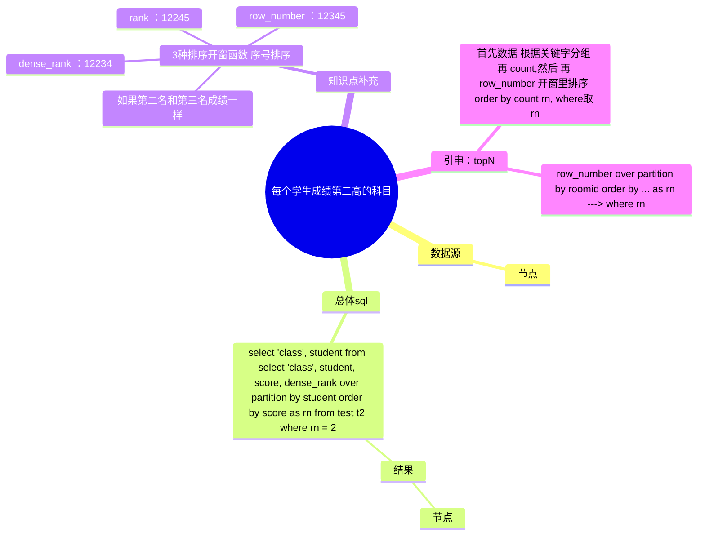
```mermaid
mindmap
  root((每个学生成绩第二高的科目))
    数据源
      节点
    总体sql
      select 'class', student from select 'class', student, score, dense_rank over partition by student order by score as rn from test t2 where rn = 2
        结果
          节点
    知识点补充
      3种排序开窗函数 序号排序
        如果第二名和第三名成绩一样
        rank ：12245
        dense_rank ：12234
        row_number ：12345
    引申：topN
      首先数据 根据关键字分组 再 count,然后 再 row_number 开窗里排序 order by count rn, where取 rn<N
      row_number over partition by roomid order by ... as rn ---> where rn<N
```

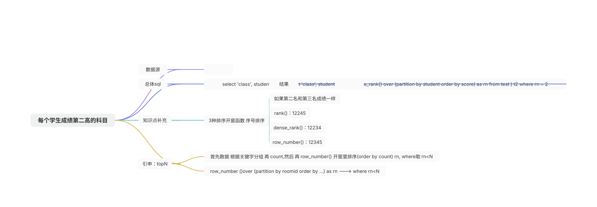

  

  

  

  

  

  

  

  

  

  

  

  

  

  

  

  

  

  

  

  

  

  

  

  

  

  

  

  

# 数值转换函数

## round（取整、精度取证函数）

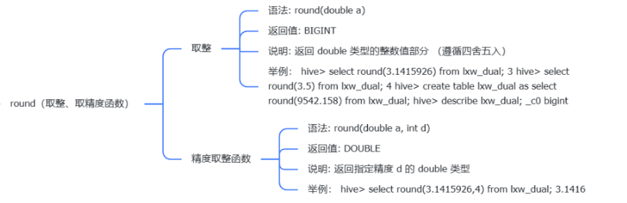

  

## floor（向下取整函数）

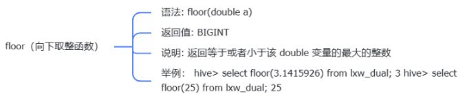

  

## cell（向上取整函数）

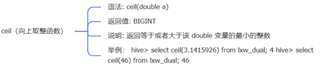

  

## abs（绝对值函数）

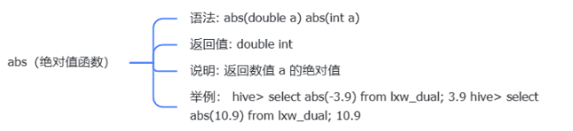

  

  

## rand（随机数函数）

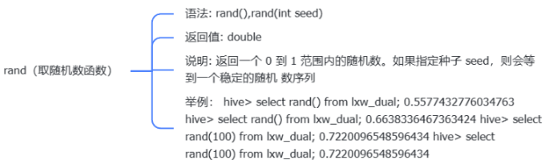

  

# 日期函数

## from\_unixtime（时间戳转换日期函数）

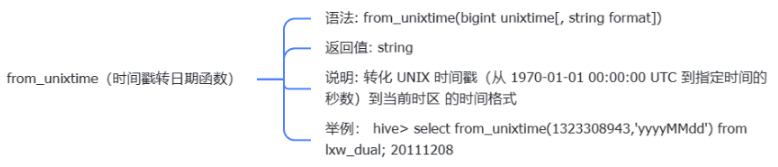

  

## unix\_timestamp（日期转时间戳函数）

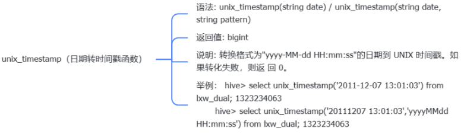

  

## to\_date（日期时间转日期函数）

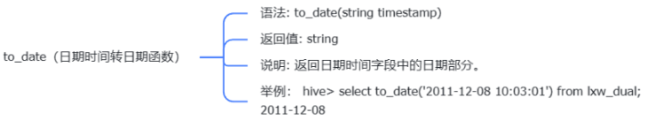

  

## year（日期转年函数）

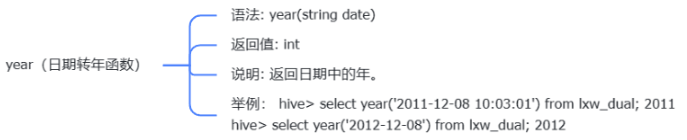

  

## month（日期转月函数）

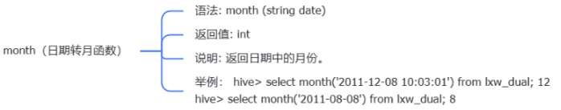

  

## day（日期转天函数）

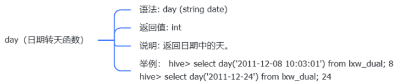

  

## hour（日期转小时函数）

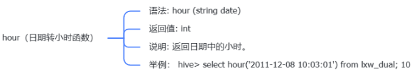

  

## minute（日期转分钟函数）

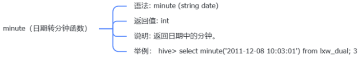

  

## second（日期转秒函数）

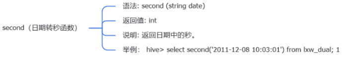

  

## weekofyear（日期转周函数）

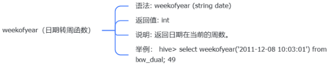

  

## datediff（日期比较函数）

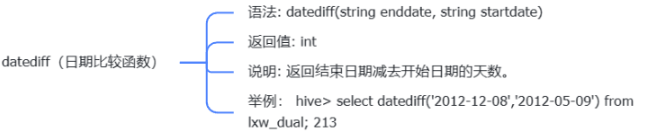

  

## date\_add（日期增加函数）

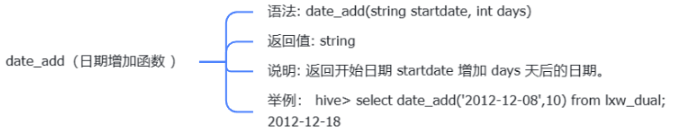

  

## date\_sub（日期减少函数）

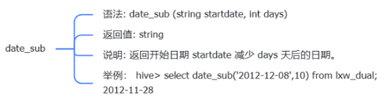

  

## months\_between（月份比较函数）

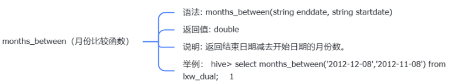

  

  

# 条件函数

## if（if判断函数）

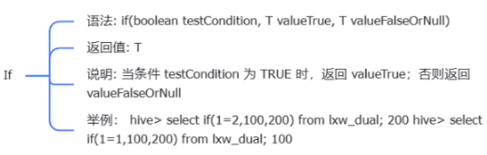

  

  

## coalesce/nvl（非空函数）

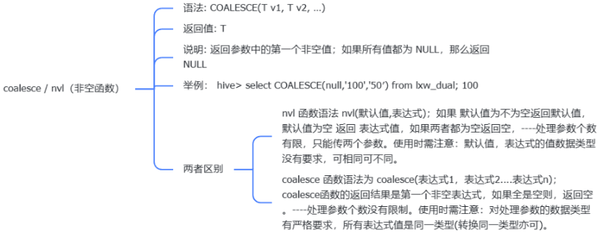

  

  

## case（case判断函数）

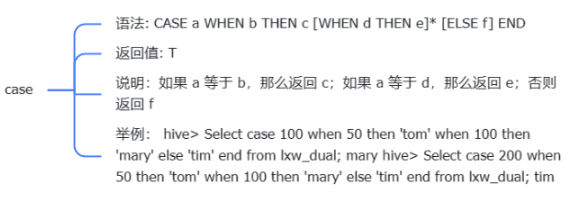

  

# 字符串函数

## length（字符串长度函数）

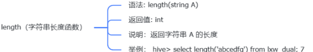

  

## reverse（字符串反转函数）

  

## concat（字符串连接函数）

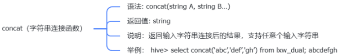

  

## concat\_ws（带分隔符字符串连接函数）

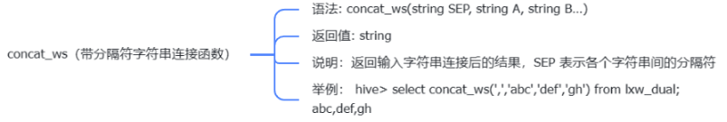

  

## substr/substring（字符串截取函数）

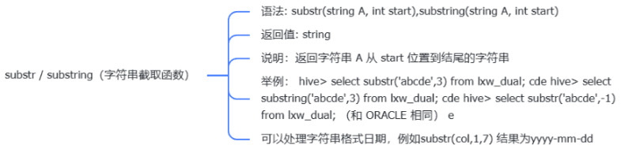

  

## upper/ucase（字符串转大写函数）

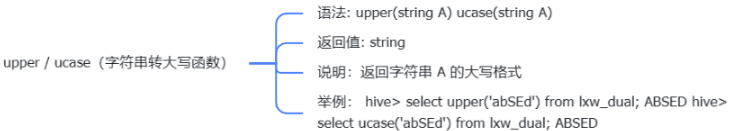

  

## lower/lcase（字符串转小写函数）

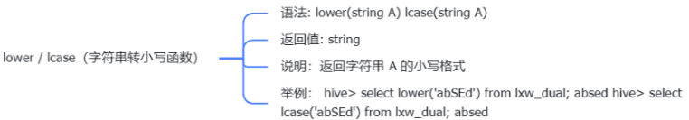

  

## trim（去空格函数）

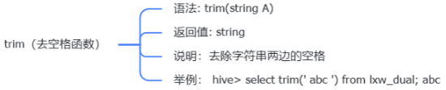

  

## regexp\_replace（正则表达式替换函数）

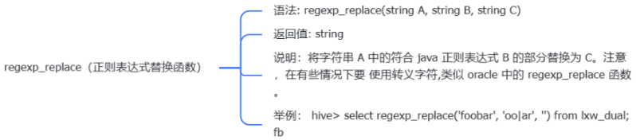

  

## regexp\_extract（正则表达式解析函数）

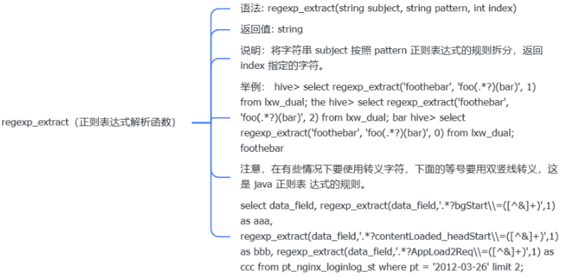

  

  

## get\_json\_object（json解析函数）

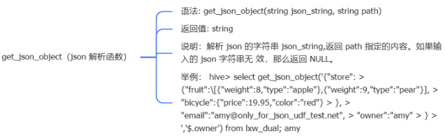

  

  

## split（分割字符串函数）

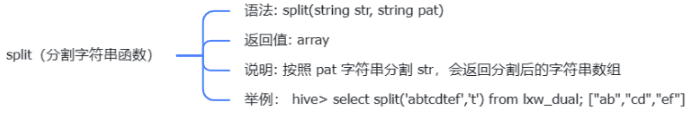

  

## explode（炸裂函数）

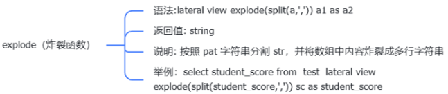

  

  

## posexplode（炸裂函数）

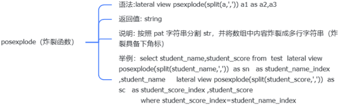

  

# 聚合函数

## count（个数统计函数）

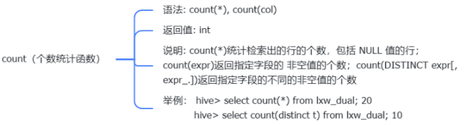

  

## sum（总和统计函数）

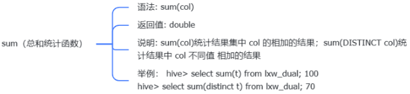

  

## avg（平均值统计函数）

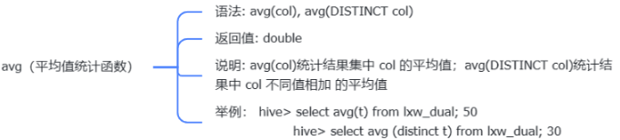

  

## min（最小值统计函数）

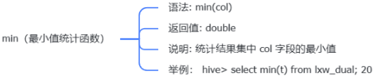

  

## max（最大值统计函数）

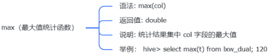

  

## collect\_list（将字段多条内容合并为一条，不去重）

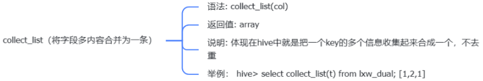

  

## collect\_set（将字段多条内容合并为一条，去重）

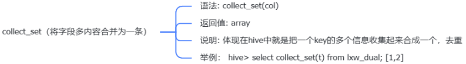

  

  

  

  

# 开窗函数

## 聚合开窗

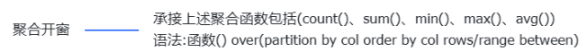

  

## 窗口函数

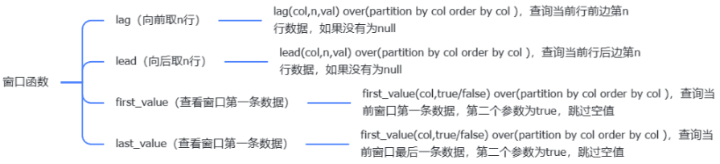

  

## 排名函数

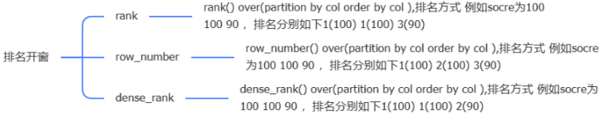

  

## 窗口范围

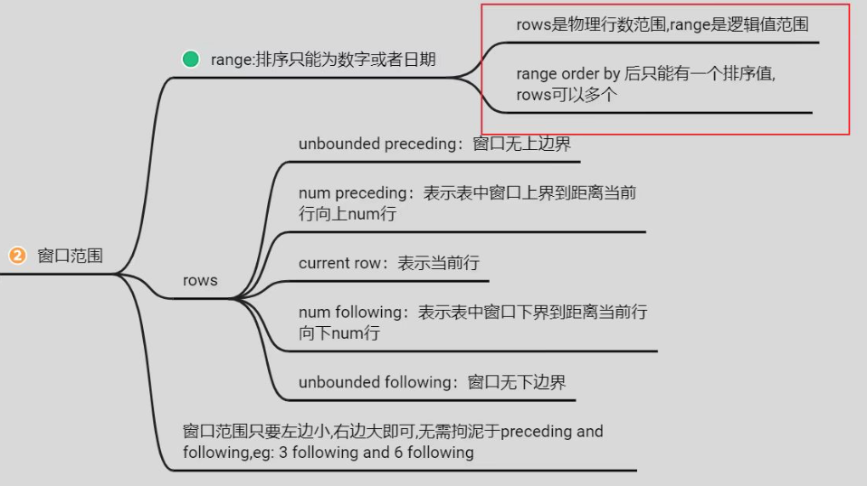

  

#