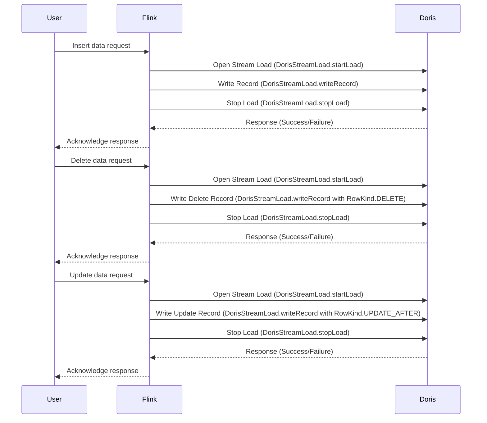
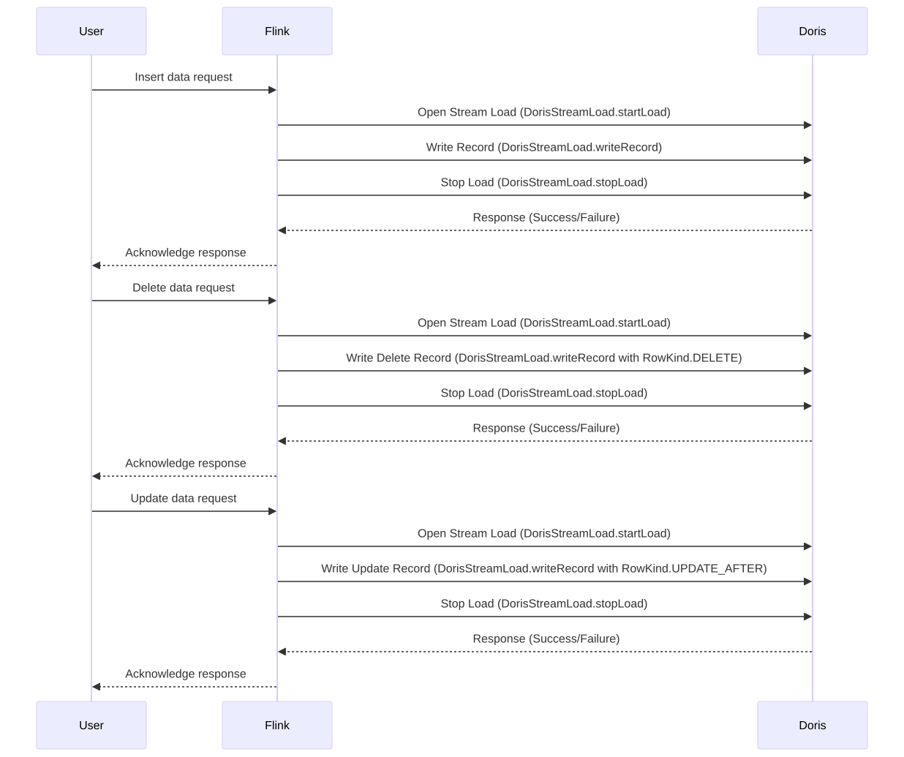

```mermaid
sequenceDiagram
    participant U as User
    participant F as Flink
    participant D as Doris

    %% Insert Operation
    U->>F: Insert data request
    F->>D: Open Stream Load (DorisStreamLoad.startLoad)
    F->>D: Write Record (DorisStreamLoad.writeRecord)
    F->>D: Stop Load (DorisStreamLoad.stopLoad)
    D-->>F: Response (Success/Failure)
    F-->>U: Acknowledge response

    %% Delete Operation
    U->>F: Delete data request
    F->>D: Open Stream Load (DorisStreamLoad.startLoad)
    F->>D: Write Delete Record (DorisStreamLoad.writeRecord with RowKind.DELETE)
    F->>D: Stop Load (DorisStreamLoad.stopLoad)
    D-->>F: Response (Success/Failure)
    F-->>U: Acknowledge response

    %% Update Operation
    U->>F: Update data request
    F->>D: Open Stream Load (DorisStreamLoad.startLoad)
    F->>D: Write Update Record (DorisStreamLoad.writeRecord with RowKind.UPDATE_AFTER)
    F->>D: Stop Load (DorisStreamLoad.stopLoad)
    D-->>F: Response (Success/Failure)
    F-->>U: Acknowledge response

```

