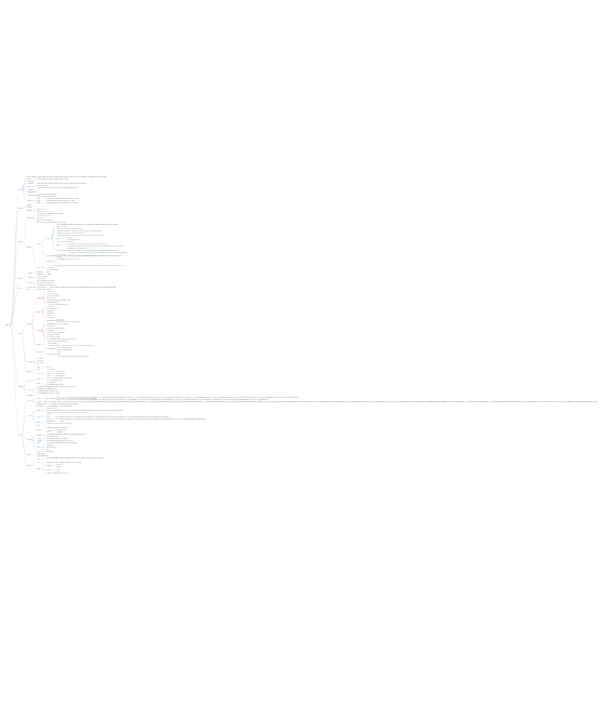

## 一、思维导图

```mermaid
mindmap
  root((Hive))
    一、概念
      基于Hadoop开发的数据仓库工具，可以把结构化的数据映射为一张表，支持用hive sql语句查询数据.本质是连接Hadoop的客户端，把hive sql转化为mapreduce程序。实际上数据存储还是在hdfs，分析数据的底层还是mapreduce spark ，资源调度还是yarn
      组成架构
        客户端client、元数据服务meta store、驱动器driver（包含各类解析器、编译器、优化器、执行器）
      hive 底层执行流程
        节点
      hive sql 编译流程
        客户端提交--调用driver驱动器--进行语法解析--逻辑计划生成和优化--物理计划生成，转化为mr任务--优化物理执行计划--执行器执行计划，得到运行结果
      hive优缺点
        sql易上手；不用写mapreduce程序；
        hivesql执行延迟性高，适合进行数据分析，不适合是实时场景；数据存储在hdfs，不支持随机写，数据无法高效update和delete；
      hive和数据库的对比
      传统数据库和数据仓库的区别
      为什么MapReduce 的执行效率很低？
        shuffle阶段有多次排序和文件合并过程，反复读写磁盘耗费时间
        mapper和reducer都是java线程，启动和销毁进程要消耗资源
      元数据访问方式
        内嵌模式
          是Hive 的默认部署方式，元数据存储在内嵌的Derby数据库，hive服务和metastore在同一个进程中运行
        本地模式
          metastore 使用独立数据库如MySQL存储元数据，hive服务和metastore在同一个进程中运行
        远程模式
          远程模式下使用 mysql 做元数据的存储，metastore 服务也独立出来自己在一个单独JVM进程中运行。
    二、数据类型
      基础数据类型
      集合数据类型
      数据类型转换
        隐式 select "1" + 2 -------> 3.0
        强制 select cast "1" as int + 2 -------> 3
    三、DDL数据定义
      数据库操作
        增： create database if not exists db_hive;
          默认存储路径是：/user/hive/warehouse/数据库名
        查询： show databases like 'db_hive*';
        使用：use db_hive;
        查看详细信息：desc database extended db_hive;
        删除：drop database db_hive2;（空） 强制删除：drop database db_hive2 cascade; 非空
      数据表操作
        表分类
          分区表
            分区：把一张大表的数据按照业务需要分开存储到多个目录，每个目录就是该表的一个分区。比如订单数据按照天分区。好处是查询数据时不需要全表扫描，只需要指定分区，就可以查询分区下的数据
            查看分区：show partitions + 表名
            增加分区：alter table ds_hive.ch4_t_par_emp add partition day='20220403' ;
            同时创建多个分区（分区之间不能有逗号）：alter table ds_hive.ch4_t_par_emp add partition day='20220404' partition day='20220405' ;
            删除单个分区：alter table ds_hive.ch4_t_par_emp drop partition day='20220403' ;
            同时删除多个分区（分区之间必须有逗号） ：alter table ds_hive.ch4_t_par_emp drop partition day='20220404' , partition day='20220405' ;
            修复分区
              add/drop partitions
              msck repair table t表名 sync partitions
            二级分区：partitioned by day string，hour string
            加载数据
              load data local inpath '/opt/module/hive/datas/dept_20220401.log' into table dept_partition partition day='20220401' ;
              insert overwrite table dept_partitionpartition day = '20220402' --指定分区select deptno, dname, loc--不用再去查询分区字段from dept_partition where day = '20200401';
            动态分区：动态分区是指向分区表 insert 数据时，被写往的分区不由用户指定，而是由每行数据的最后一个字段的值来动态的决定。使用动态分区，可只用一个 insert 语句将数据写入多个分区。
              1、动态分区功能总开关 set hive.exec.dynamic.partition=true;
              2、非严格模式允许所有的分区字段都是动态分区：set hive.exec.dynamic.partition.mode=nonstrict
              3、设置动态分区 insert into table dept_partition_dynamic partition loc --只有分区字段，但不指定哪个分区select deptno, dname, loc --必须在select最后一列加上分区字段from dept;
          分桶表：分区针对的是数据的存储路径，分桶针对的是数据文件。分桶表的基本原理是，首先为每行数据计算某个指定字段的数据的hash值，再取模指 定分桶数，最后将取模运算结果相同的行，写入同一个文件中，这个文件就称为一个分桶。
            clustered by id into 4 buckets
            常用于抽象查询
          内部表、外部表
            建表：内部表不需要指定location；外部表： 指定 external， location
            节点
            节点
        建表
          1、create external table table_name col_name col_type row format delimited fields terminated by "," collection items terminated by "_" map keys terminated by ":" lines terminated by "\n" store as textFile loaction
          2、create table as select
          3、create table like 仅复制表结构
    四、数据操作
      load加载数据
        加载本地文件到hive
          源文件还在
        加载hdfs文件到hive
          源文件被删除
      insert 插入数据
        insert overwrite table 覆盖写
        insert into table 追加写
      Import&Export
        用于两个Hadoop平台集群之间Hive表迁移，先导出再导入
        EXPORT TABLE tablename TO 'export_target_path'
        IMPORT EXTERNAL TABLE tablename FROM 'source_path'
    五、查询
      common join的mr实现流程
        1、在Map阶段，将两个表的数据分别映射成键值对形式。key是关联字段，value是表用到的列2、在Shuffle阶段，对key值进行hash计算，按照hash值对数据进行分组后分配到不同的reduce中3、在Reduce阶段，拉取指定hash值的数据，进行join连接处理
          节点
      map join
        在map端完成join，没有reduce，详见join优化
    六、函数
      内置函数
        字符串函数
          concat 'a','bc' -->abc
          concat_ws '-','a','bc' -->a-bc
          substr 'abcde',3 从第三位到最后-->cde
          upper、lower 大小写转换
          replace 'abcde','bc','傻逼' 将字符串A中的子字符串B替换为C-->a傻逼de
          正则表达式替换函数:regexp_replace
          spilt 'a-b-c-d-e',',' 按符号切割，返回数组--> 'a','b','c','d','e'
        数值函数
          round 3.55 ：四舍五入-->4
          round 3.55,1 保留一位小数-->3.6
          ceil 3.1 向上取整-->4
          floor 3.9 向下取整-->3
          abs :绝对值
          negative ：相反数
        日期函数
          获取当前或者指定时间的UNIX时间戳:unix_timestamp
            select unix_timestamp ;
            select unix_timestamp '2022/08/08 08-08-08','yyyy/MM/dd HH-mm-ss' ;
          UNIX 时间戳转日期函数:from_unixtime
            select from_unixtime 1659946088 ;
          current_date：当前日期
          current_timestamp：当前的日期加时间，并且精确的毫秒
          month：获取日期中的月
          datediff end_date,start_date ：两个日期相差的天数
          date_add '2022-08-08',2 ：日期加天数
          date_sub '2022-08-08',2 ：日期减天数
          date_format：将标准日期解析成指定格式字符串
            select date_format '2022-08-08','yyyy年-MM月-dd日'
          last_day string date ：返回这个月的最后一天的日期，忽略时分秒
        条件函数
          select if 10 > 5,'正确','错误' ;
          SELECT stu_id,CASE when score >= 90 then '优秀' when score >= 80 and score < 90 then '良好' else '一般' end AS levelfrom score_info
        行转列、列转行
          行转列：多行数据转换为一行
            collect_set col --将某字段的值进行去重汇总
            collect_list col --将某字段的值进行不去重汇总
          列转行：爆炸函数，把一行数据拆成多行
            EXPLODE col
            lateral view
            select name, subjects from ds_hive.ch8lateral view explode split subjects,',' tmp AS subject;
      用户自定义函数
        UDF：一行进一行出
        UDAF：多行进一行出
        UDTF：一行进多行出
        节点
      窗口函数
        跨行取值
          lead、lag
        极值
          first_value、last_value
        排序
          rank
            重复排名，会跳过 12335
          dense_rank
            重复排名，不跳过 12334
          row_number
            排名连续，无重复值 12345
    七、压缩和存储
      存储
        行式存储
          textfile：一行文本对应一条表记录，数据不做压缩，占用空间大;不支持hive切片
          sequencefile：以二进制格式存储文件，支持压缩
        列式存储
          orcfile：基本存储单元为strip
            节点
          parquet：支持嵌套结构，存储机构为：行组-列块-页
      压缩
        gzip：压缩率比较高，而且压缩/解压速度也比较快。Hadoop本身支持，大部分linux自导gzip命令，使用方便；不支持split
        bizip2:压缩率比gizp还高，但压缩和解压速度慢；支持split
        lzo：压缩/解压速度快,压缩率不如gzip；命令需要安装，支持spilt；
        snappy：高速压缩速度和合理的压缩率，压缩率不如gzip；不支持split
      序列化和反序列化
        节点
    八、调优
      原理
        mr过程
          简化版：Input→程序的输入 Map→分，将任务在逻辑上划分多个小的任务 Shuffle→分组、排序 Reduce→合，将shuffle处理的结果，进行聚合 Output→程序的输出
            maptask
              1.Read 阶段： MapTask 通过用户编写的 RecordReader ，从输入的 InputSplit 中解析出一个个 key / value 。2.Map 阶段：将解析出的 key / value 交给用户编写的 Map 函数处理，并产生一系列新的 key / value 。3.Collect 阶段：在用户编写的 map 函数中，数据处理完成后，一般会调用 outputCollector.collect 输出结果，在该函数内部，它会将生成的 key / value 分片 通过调用partitioner ，并写入一个环形内存缓冲区中 该缓冲区默认大小是 100MB 。4.Spill 阶段：即“溢写”，当缓冲区快要溢出时 默认达到缓冲区大小的 80 % ，会在本地文件系统创建一个溢出文件，将该缓冲区的数据写入这个文件。5.Combine 阶段：当所有数据处理完成以后， MapTask 会对所有临时文件进行一次合并，以确保最终只会生成一个数据文件。
            reducetask
              Copy 阶段： Reduce 会从各个 MapTask 上远程复制一片数据（每个 MapTask 传来的数据都是有序的），并针对某一片数据，如果其大小超过一定國值，则写到磁盘上，否则直接放到内存中。Merge 阶段：在远程复制数据的同时， ReduceTask 会启动两个后台线程，分别对内存和磁盘上的文件进行合并，以防止内存使用过多或者磁盘文件过多。Sort 阶段：用户编写 reduce 方法输入数据是按 key 进行聚集的一组数据。 Reduce 阶段：对排序后的键值对调用 reduce 方法，键相等的键值对调用一次 reduce 方法，每次调用会产生零个或者多个键值对，最后把这些输出的键值对写入到 HDFS 中Write 阶段： reduce 函数将计算结果写到 HDFS 上。
        shuffle过程
          1.Map 阶段 （1）MapTask 处理的结果会暂且放入一个内存缓冲区（默认大小100MB）内，当缓冲区快要溢出时（达到 80%），会在本地文件系统创建一个溢出文件，将该缓冲区的数据写入这个文件。 若MapTask缓冲区达到80%将要溢出，把缓冲区数据溢写到磁盘中 （2）写入磁盘前，线程会根据ReduceTask 的数量将数据分区，一个Reduce 任务对应一个分区的数据。这样做目的是为了避免有些ruduce任务分配大量数据，而有些reduce任务分到很少的数据，甚至没有分到数据的尴尬局面（将数据进行分区）。（3）分完数据后，会对每个分区的数据进行排序，如果此时设置了 Combiner，将排序后的结果进行Combine 操作，这样做目的时尽可能少地执行数据写入磁盘的操作。 对分区数据进行排序，进行Combine操作 。（4）当 Map 任务输出最后一个记录时，可能有很多溢出文件，这时需要将这些文件合并，合并过程中不断地进行排序和 Combine 操作，其目的有两个：一是尽量减少每次写入磁盘的数据量；二是尽量减少下一复制阶段网络传输的数据量。最后合并成一个已分区且排序的文件 对溢出文件进行合并，合并时进行排序和Combine操作 。（5）将分区数据复制给对应的Reduce任务。 2.Reduce 阶段 （1）Reduce 会接受到不同map任务传来的数据，并且每个map传来的数据都是有序的。如果Reduce 阶段接受到的数据量相当小，则直接存储在内存中，如果数据量超过了该缓冲区大小的一定比例，则对数据合并后溢写到磁盘中。（Reduce 接受到的数据量小，存在内存中，否则将数据合并后存在磁盘）。（2）随着溢写文件的增多，后台线程会将它们合并成一个更大的有序的文件，这样做是为了给后面的合并节省时间。（后台线程会将溢出文件合并成一个大的有序的文件）（3）合并的过程中产生了许多中间文件（写入磁盘了），但 MapReduce 会让写入磁盘的数据尽可能地少，并且最后一次合并地结果没有写入磁盘，而是直接输入到reduce函数。
            一共有三次排序，reduce2次map1次，先排序好可以减小内存开销
        执行计划查看：Explain 呈现的执行计划，由一系列 Stage 组成，这一系列 Stage 具有依赖关系，每个Stage 对应一个MapReduce Job
          节点
      sql调优
        列裁剪、分区裁剪
          1.列裁剪：在查询时只读取需要的列。 2.分区裁剪：在查询中只读取需要的分区。
        聚合优化
          map 端聚合：减少 Shuffle 数据量
            节点
          Common Join是Hive中最稳定的join算法，其通过一个MapReduce Job完成一个join操作。Map端负责读取join操作所需表的数据，并按照关联字段进行分区，通过Shuffle，将其发送到Reduce端，相同key的数据在Reduce端完成最终的Join操作。
          count dinstinct colum 优化
            select count product_id from select product_id from order_detailgroup by product_id t1;
        join优化
          Common Join
          Map Join
            Map Join算法可以通过两个只有map阶段的Job完成一个join操作。其适用场景为大表join小表。若某join操作满足要求，则第一个Job会读取小表数据，将其制作为hash table，并上传至Hadoop分布式缓存（本质上是上传至HDFS）。第二个Job会先从分布式缓存中读取小表数据，并缓存在Map Task的内存中，然后扫描大表数据，这样在map端即可完成关联操作。
          Bucket Map Join
            Bucket Map Join是对Map Join算法的改进，其打破了Map Join只适用于大表join小表的限制，可用于大表join大表的场景。 Bucket Map Join的核心思想是：若能保证参与join的表均为分桶表，且关联字段为分桶字段，且其中一张表的分桶数量是另外一张表分桶数量的整数倍，就能保证参与join的两张表的分桶之间具有明确的关联关系，所以就可以在两表的分桶间进行Map Join操作了。这样一来，第二个Job的Map端就无需再缓存小表的全表数据了，而只需缓存其所需的分桶即可。
        谓词下推
          尽量将过滤操作前移，以减少后续计算步骤的 数据量。
            节点
          是否启动谓词下推（predicate pushdown）优化 set hive.optimize.ppd = true;
        合理排序
          节点
      参数调优
        控制map数
          map数量决定因素：输入文件个数、输入文件大小、集群block块大小
          如何调整map数
            小文件进行合并，减少map数
            复杂文件增加Map数
        控制reduce数
          一般hive会自行估算并行度，文件大小除以单个reduce的数据量得到一个值，取该值和和最大并行度的更小者作为最终reduce数
          也可以由用户直接指定reduce数量
        job并行运行
          带有子查询的hql，如果子查询间没有依赖关系，可以开启任务并行
        Fetch抓取模式
          Hive中对某些情况的查询可以不必使用 MapReduce 计算。例如： select * from emp
        本地模式
          Hive 可以通过本地模式在单台机器上处理所有的任务。对于小数据集，执行时间可以明显被缩短。
        严格模式
          分区表不使用分区过滤
          使用order by没有limit 过滤
          笛卡尔积
        CBO优化
          即基于计算成本的优化
      其他优化
        合理选择分区表与分桶表
        合理选择文件存储格式和压缩方式
      数据倾斜
        原理
          某个key或者某些key的数据量远超其他key，导致在shuffle 阶段，大量相同 key 的数据被发往同一个 Reduce，进而导致该Reduce 所需的时间远超其他Reduce，成为整个任务的瓶颈。
          节点
        表象
          任务进度长时间维持在99%（或100%），查看任务监控页面，发现只有少量（1个或几个）reduce子任务未完成
        解决方案
          分组聚合倾斜
            开启map-side聚合
            开启负载均衡
          join倾斜
            map-join
            skew join
          先进行group by col分组降低数据量，再进行count Dinstinct col
```

  

## 二、hive优化