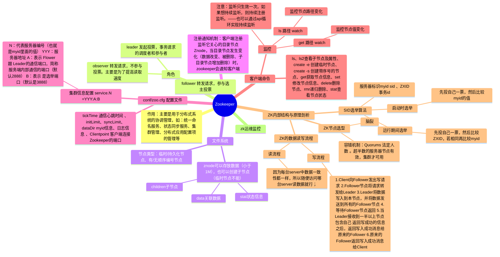
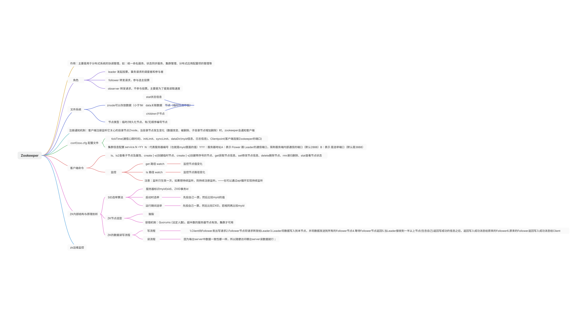

```mermaid
mindmap
  root((Zookeeper))
    作用：主要是用于分布式系统的协调管理，如：统一命名服务、状态同步服务、集群管理、分布式应用配置项的管理等
    角色
      leader 发起投票，事务请求的调度者和参与者
      follower 转发请求，参与选主投票
      observer 转发请求，不参与投票。主要是为了提高读取速度
    文件系统
      znode可以存放数据（小于1M），也可以创建子节点（临时节点不能）
        stat状态信息
        data关联数据
        children子节点
      节点类型：临时/持久化节点、有/无顺序编号节点
    注册通知机制：客户端注册监听它关心的目录节点Znode，当目录节点发生变化（数据改变、被删除、子目录节点增加删除）时，zookeeper会通知客户端
    conf/zoo.cfg 配置文件
      tickTime 通信心跳时间 、initLimit、syncLimit、dataDir myid信息、日志信息 、Clientpoint 客户端连接Zookeeper的端口
      集群信息配置 service.N =YYY:A:B
        N：代表服务器编号（也就是myid里面的值） YYY：服务器地址 A：表示 Flower 跟 Leader的通信端口，简称服务端内部通信的端口（默认2888） B：表示 是选举端口（默认是3888）
    客户端命令
      ls、ls2查看子节点及属性、create -e 创建临时节点、create -s 创建带序号的节点、get获取节点信息、set修改节点信息、delete删除节点、rmr递归删除、stat查看节点状态
      监控
        get 路径 watch
          监控节点值变化
        ls 路径 watch
          监控节点路径变化
        注意：监听只生效一次，如果想持续监听，则持续注册监听。——也可以通过api循环实现持续监听
    ZK内部结构与原理剖析
      SID选举算法
        服务器标识myid sid 、ZXID事务id
        启动时选举
          先投自己一票，然后比较myid的值
        运行期间选举
          先投自己一票，然后比较ZXID，若相同再比较myid
      ZK节点选型
        脑裂
        容错机制：Quorums 法定人数 。超半数的服务器节点有效，集群才可用
      ZK的数据读写流程
        写流程
          1.Client向Follower发出写请求 2.Follower节点将请求转发给Leader 3.Leader将数据写入到本节点，并将数据发送到所有的Follower节点 4.等待Follower节点返回 5.当Leader接收到一半以上节点 包含自己 返回写成功的信息之后，返回写入成功消息给原来的Follower 6.原来的Follower返回写入成功消息给Client
        读流程
          因为每台server中数据一致性都一样，所以随便访问哪台server读数据就行；
    zk运维监控
```

